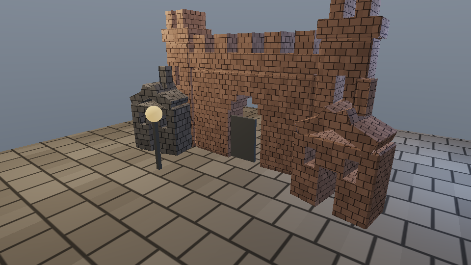

# Aster Learning Engine

Aster Learning Engine is an educational C/C++ game-engine study project by
Faruk Alpay. The project keeps the engine, sample game, renderer, physics,
input, UI, asset, and test code in one readable tree so each subsystem can be
studied, modified, and verified without hiding the implementation behind a
large commercial engine.

The included game sample is **Lumen Run**. It is intentionally treated as a
teaching scene: gameplay, camera control, collision, material rendering,
procedural terrain, HUD, inventory, screenshots, and smoke tests all exercise
the reusable engine layer under `include/aster` and `src`.

## Current Captures

The images below were regenerated from the current build.




## Educational Goals

- Show how a compact engine is split into scene, render, physics, input, UI,
  asset, game, and platform layers.
- Keep app-facing files thin while reusable behavior stays in library modules.
- Prefer inspectable systems over hidden engine magic: camera collision,
  line-of-sight fade, procedural materials, terrain generation, and screenshots
  are all implemented in source.
- Keep the build reproducible with local targets for tests, smoke checks, and
  framebuffer captures.
- Make the project useful as a learning base, not as a vendor drop or black-box
  framework.

## Repository Layout

| Path | Purpose |
| --- | --- |
| `apps/` | Thin executables for Lumen Run, Studio, preview, and net probe |
| `include/aster/` | Public engine headers |
| `src/` | Engine and sample implementation |
| `src/runtime/` | Integrated runtime/platform support code |
| `tests/` | Unit and regression tests |
| `assets/` | Sample assets and README screenshots |
| `docs/` | Architecture and research notes |

## Build

Prerequisites:

- CMake 3.24+
- A C++20 compiler
- OpenGL-capable desktop environment
- macOS or a Linux desktop with the needed windowing development packages

```bash
cmake -S . -B build -DCMAKE_BUILD_TYPE=Release
cmake --build build --parallel
ctest --test-dir build --output-on-failure
```

Run the sample game:

```bash
./build/aster_lumen_run
```

Run the learning studio:

```bash
./build/aster_studio
```

Run smoke checks:

```bash
./build/aster_lumen_run --smoke-test
./build/aster_studio --smoke-test
./build/aster_net_probe
```

## Refresh Screenshots

```bash
mkdir -p assets/screenshots /tmp/aster_learning_shots
rm -f assets/screenshots/*

./build/aster_lumen_run --screenshot /tmp/aster_learning_shots/lumen_run.ppm --capture-hud --no-vsync --window-width 1600 --window-height 900
./build/aster_lumen_run --screenshot /tmp/aster_learning_shots/lumen_inventory.ppm --open-inventory --capture-hud --no-vsync --window-width 1600 --window-height 900
./build/aster_studio --screenshot /tmp/aster_learning_shots/studio.ppm --no-vsync --window-width 1600 --window-height 900
./build/aster_preview --output /tmp/aster_learning_shots/preview.ppm --width 960 --height 540

sips -s format png /tmp/aster_learning_shots/lumen_run.ppm --out assets/screenshots/lumen_run.png
sips -s format png /tmp/aster_learning_shots/lumen_inventory.ppm --out assets/screenshots/lumen_inventory.png
sips -s format png /tmp/aster_learning_shots/studio.ppm --out assets/screenshots/learning_studio.png
sips -s format png /tmp/aster_learning_shots/preview.ppm --out assets/screenshots/offline_preview.png
```

On non-macOS hosts, replace `sips` with ImageMagick, FFmpeg, or another PPM to
PNG converter.

## Notes For Study

`aster_lumen_run` wires the window, controls, camera, HUD, and game state. The
camera resolver, physics world, renderer, procedural mesh builders, terrain
generation, UI canvas, and inventory logic live in reusable engine modules.

The renderer currently uses a native desktop path with procedural meshes,
procedural material patterns, fog, tonemapping, contact shadows, and native
framebuffer capture. It is deliberately small enough to read in one sitting.

## Authorship

Engine-owned source files include:

```text
Author: Faruk Alpay
Do not remove this notice.
```

This notice is not applied to integrated runtime/vendor-style support code where
claiming authorship would be misleading.

## License

Original Aster Learning Engine code and assets are available for educational,
non-commercial, and nonprofit use with attribution. See [LICENSE](LICENSE).
