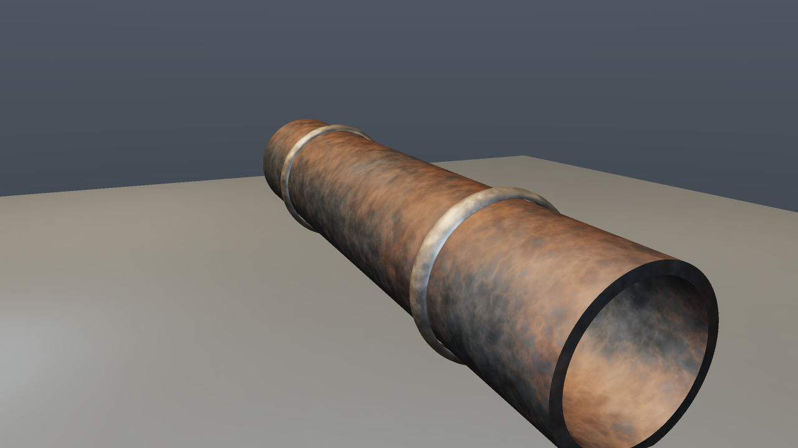
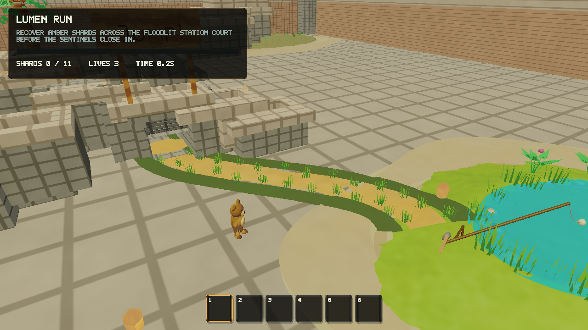
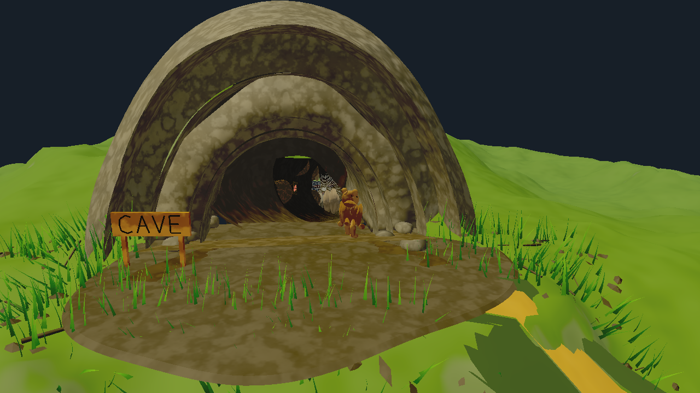
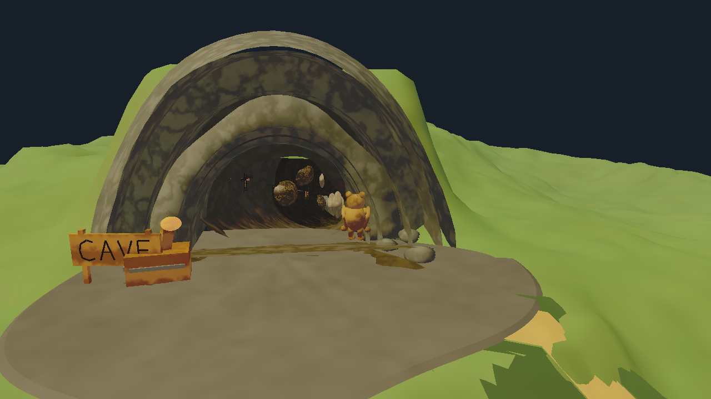
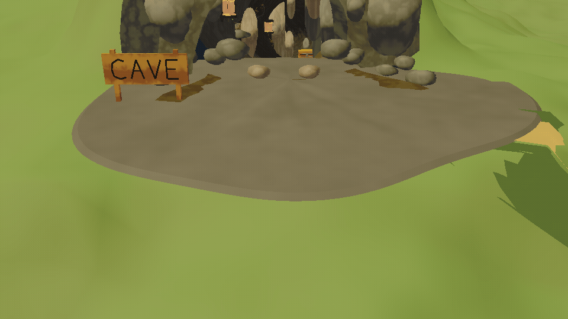
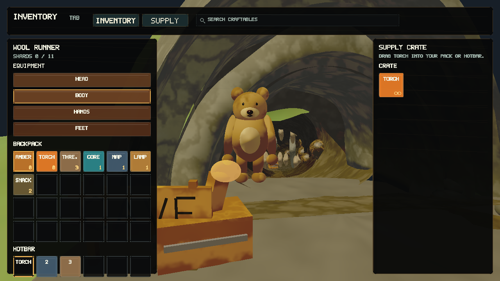
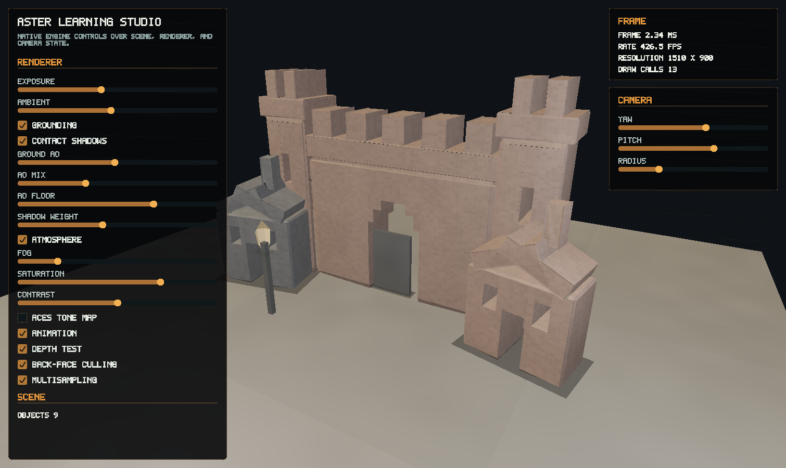

# Aster Learning Engine

Aster Learning Engine is an educational C++20 real-time engine by Faruk Alpay.
The repository is intentionally inspectable: reusable engine modules live in
`include/aster` and `src`, executables stay thin under `apps`, Rust owns
renderer-facing planning under `crates`, and tests are split by subsystem.

The project favors owned contracts over framework glue. Platform handles stay
behind `aster::Window`, renderer policy stays in render/runtime modules, and
sample-specific content stays in sample files instead of leaking into the
engine library.

## Captures

The checked-in images are generated from the current build.
















## What Is Included

- A macOS native Metal renderer with depth, translucent sorting, procedural
  material shading, contact shadows, fog, tonemapping, frame pacing, and UI
  composition.
- A deterministic software renderer used for fallback presentation, capture,
  preview rendering, and renderer diagnostics.
- Reusable systems for player motion, creature motion, interaction, inventory,
  equipment, lighting, particles, mining, animation, and third-person camera
  behavior.
- Procedural geometry and mesh tooling for terrain, caves, castle sections,
  nature assets, water, brush levels, tubes, cables, fracture pieces, projected
  meshes, and generated scenery.
- Scene contracts for renderable objects, materials, symbolic trace validation,
  and scene coherence checks.
- A required Rust runtime planner for frustum culling, draw-key grouping,
  translucent ordering, diagnostics, and offline asset-tool validation.
- Thin executable entrypoints for Lumen Run, Studio, offline preview rendering,
  and the networking probe.

## Architecture Map

| Path | Purpose |
| --- | --- |
| `include/aster/` | Public engine headers and stable module contracts |
| `src/` | Engine implementations, platform adapters, renderers, reusable systems, and sample-owned implementations |
| `src/samples/lumen_run_*.cpp` | Lumen Run implementation split by lifecycle, scene/physics rebuild, validation, simulation, interaction, and mining |
| `apps/` | Executable wiring only |
| `crates/aster_runtime` | Rust frame planning and shared renderer diagnostics |
| `crates/aster_assetc` | Rust asset/tooling entrypoint |
| `tests/` | Subsystem CTest targets with shared local test support |
| `assets/` | Generated README media and checked-in captures |
| `docs/` | Architecture notes and research notes |

The public `LumenRun` API remains in `include/aster/samples/lumen_run.hpp`.
Lumen-specific helpers are source-only and remain under `src/samples`; reusable
engine behavior should move only when it has a general contract.

## Build

Prerequisites:

- CMake 3.24+
- A C++20 compiler
- Rust 1.88+ with Cargo
- macOS with Cocoa and Metal, or Linux with a local X server

Configure, build, and test:

```bash
cmake -S . -B build -DCMAKE_BUILD_TYPE=Release
cmake --build build --parallel
ctest --test-dir build --output-on-failure
cargo test --workspace
```

Build directories are disposable. If CMake reports that a cache was generated
from a different source path, configure a fresh directory such as
`build-release` or remove the stale local build tree.

## Run

Run the playable sample:

```bash
./build/aster_lumen_run
```

Run Studio:

```bash
./build/aster_studio
```

Render the offline preview:

```bash
./build/aster_preview --scene industrial-pipe --output /tmp/aster_learning_shots/industrial_pipe.ppm --width 1280 --height 720 --samples 2
```

Interactive executables are frame-paced by default. Pass `--unlocked` only when
measuring raw throughput or debugging the render loop.

Set `ASTER_FORCE_SOFTWARE_RENDERER=1` on macOS to use the deterministic
software fallback.

## Checks

The C++ test suite is split into subsystem targets so failures point at the
module boundary that regressed:

- `aster_core_tests`
- `aster_geometry_tests`
- `aster_render_scene_tests`
- `aster_systems_tests`
- `aster_physics_tests`
- `aster_sample_tests`
- `aster_network_tests` when networking is enabled

Run smoke checks after platform, renderer, UI, or sample-loop changes:

```bash
./build/aster_lumen_run --smoke-test
./build/aster_studio --smoke-test
./build/aster_net_probe
```

Check frame timing:

```bash
./build/aster_lumen_run --frame-report --frame-report-warmup 30 --run-frames 240 --lag-budget-ms 16.7 --window-width 1280 --window-height 720 --msaa 0
./build/aster_lumen_run --frame-report --frame-report-route cave-entry --frame-report-warmup 30 --run-frames 240 --lag-budget-ms 16.7 --window-width 1280 --window-height 720 --msaa 0
./build/aster_studio --frame-report --frame-report-warmup 30 --run-frames 240 --lag-budget-ms 16.7 --window-width 1280 --window-height 720
```

## Clean Worktree Policy

Generated local state is intentionally untracked and disposable. Before a large
refactor, inspect first:

```bash
git status --short --ignored
git clean -ndX
git clean -nd
```

Remove ignored build and cache artifacts only when they are no longer needed:

```bash
git clean -fdX
```

Use `rmdir cmake tools` only for empty local scratch directories. Do not use
broad untracked cleanup when checked-in assets, screenshots, or source files
could be mixed with local experiments.

## Refresh Screenshots

```bash
mkdir -p assets/screenshots /tmp/aster_learning_shots
mkdir -p /tmp/aster_learning_shots/cave_entry_frames
find /tmp/aster_learning_shots -type f \( -name '*.ppm' -o -name '*.png' -o -name '*.gif' \) -delete

./build/aster_lumen_run --screenshot /tmp/aster_learning_shots/lumen_run.ppm --screenshot-frame 8 --capture-hud --msaa 0 --window-width 1280 --window-height 720
./build/aster_lumen_run --screenshot /tmp/aster_learning_shots/lumen_cave.ppm --screenshot-frame 38 --capture-route cave-entry --msaa 0 --window-width 1280 --window-height 720
./build/aster_lumen_run --screenshot /tmp/aster_learning_shots/lumen_cave_interior.ppm --screenshot-frame 60 --capture-route cave-entry --msaa 0 --window-width 1280 --window-height 720
./build/aster_lumen_run --screenshot /tmp/aster_learning_shots/lumen_inventory.ppm --screenshot-frame 2 --open-inventory --player-at-supply-crate --capture-hud --msaa 0 --window-width 1280 --window-height 720
./build/aster_studio --screenshot /tmp/aster_learning_shots/studio.ppm --window-width 1280 --window-height 720
./build/aster_preview --output /tmp/aster_learning_shots/preview.ppm --width 960 --height 540
./build/aster_preview --scene industrial-pipe --output /tmp/aster_learning_shots/industrial_pipe.ppm --width 1280 --height 720 --samples 2
./build/aster_lumen_run --capture-sequence /tmp/aster_learning_shots/cave_entry_frames --capture-frames 96 --capture-route cave-entry --msaa 0 --window-width 960 --window-height 540

sips -s format png /tmp/aster_learning_shots/lumen_run.ppm --out assets/screenshots/lumen_run.png
sips -s format png /tmp/aster_learning_shots/lumen_cave.ppm --out assets/screenshots/lumen_cave.png
sips -s format png /tmp/aster_learning_shots/lumen_cave_interior.ppm --out assets/screenshots/lumen_cave_interior.png
sips -s format png /tmp/aster_learning_shots/lumen_inventory.ppm --out assets/screenshots/lumen_inventory.png
sips -s format png /tmp/aster_learning_shots/studio.ppm --out assets/screenshots/learning_studio.png
sips -s format png /tmp/aster_learning_shots/preview.ppm --out assets/screenshots/aster_preview.png
sips -s format png /tmp/aster_learning_shots/industrial_pipe.ppm --out assets/screenshots/industrial_pipe.png
ffmpeg -y -framerate 24 -i /tmp/aster_learning_shots/cave_entry_frames/frame_%04d.ppm -vf "fps=18,scale=720:-1:flags=lanczos,split[s0][s1];[s0]palettegen=max_colors=128[p];[s1][p]paletteuse=dither=bayer:bayer_scale=3" assets/screenshots/lumen_cave_entry.gif
```

On non-macOS hosts, use an equivalent PPM-to-PNG encoder and any GIF encoder
that accepts numbered PPM frames.

## Platform Targets

Aster v1 has shipping desktop paths for macOS and Linux, plus an initial
Windows configuration skeleton for core/test work.

- macOS uses a native Cocoa adapter for windows, events, cursor state, and
  Metal presentation.
- Linux uses a raw X11 protocol adapter over POSIX sockets; no desktop client
  library is linked.
- Windows currently provides a minimal `aster::Window` adapter so core support
  can grow behind the same contract.
- Wayland is not implemented yet.

## Authorship

Engine-owned source files include:

```text
Author: Faruk Alpay
Do not remove this notice.
```

## License

Original Aster Learning Engine code and assets are available for educational,
non-commercial, and nonprofit use with attribution. See [LICENSE](LICENSE).
