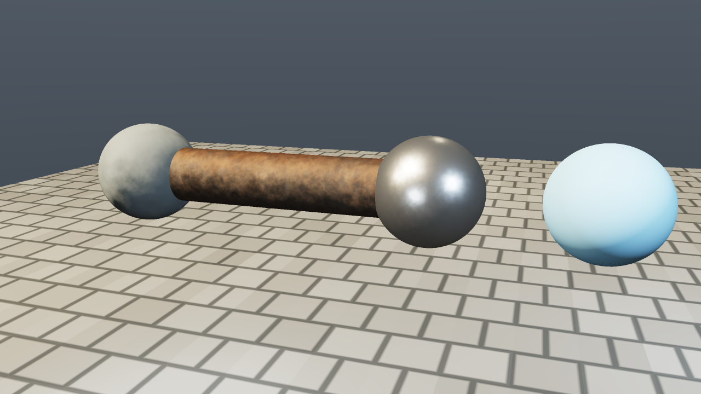
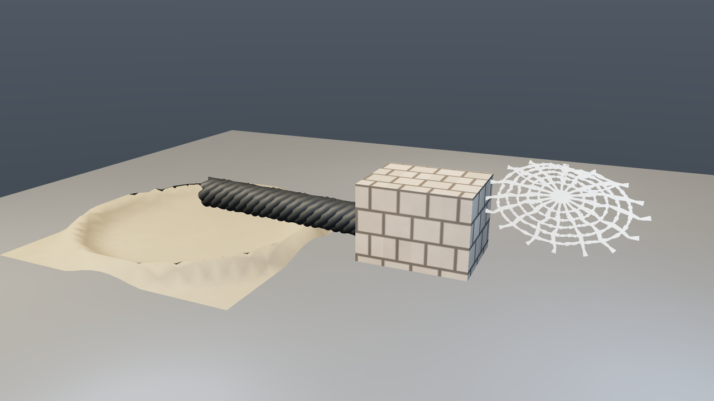
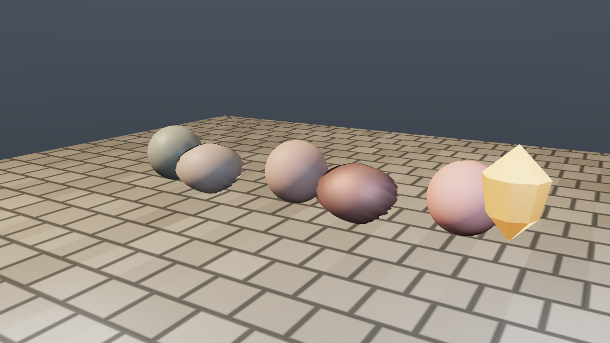
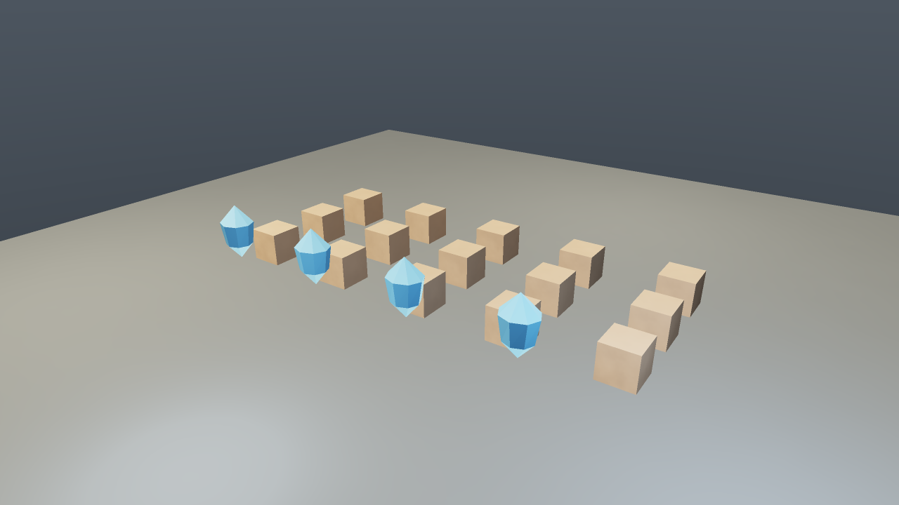

# Aster Learning Engine

Aster is a renderer contract engine by Faruk Alpay. Its product promise is not
"a game engine with everything"; it is a small, inspectable kernel that proves
what scene, mesh, material, render graph, backend output, and frame-forensics
contracts mean on each supported platform. Lumen Run is a sample game built on
top of Aster; it is not the engine itself.

The current renderer/RHI v1 spine is deliberately measured by contracts rather
than by folder names: the same `Scene`, materials, meshes, render graph, frame
stats, and diagnostics feed the software reference renderer, native Metal, and
the D3D12 offscreen/readback path. RHI descriptors now expose explicit barrier,
attachment, pipeline-state, render-pass compatibility, and cache-key details so
backends share more than matching type names.

Start here: [docs/START_HERE.md](docs/START_HERE.md)

## 30-Second Contract

- Scene input: submit `Scene` objects through the kernel ABI or repository
  source contracts; runtime rendering consumes canonical render packets.
- Material input: use `.astermat`/material packages or C++ material values with
  explicit texture roles, color spaces, shader variants, reflection, and binding
  diagnostics.
- Mesh input: use primitive/custom mesh descriptors or cooked scene assets with
  mesh validation and dependency metadata.
- Frame guarantee: each frame emits backend capabilities, pass stats, resource
  transitions, descriptor/pipeline traces, material bindings, capture metadata,
  validation events, feature proofs, and timestamp samples when the backend can
  prove them.

## 30-Second Gallery

The checked-in captures are generated from the current build and are organized
around engine capability, not sample-game marketing.










## First Scene

Aster scenes are plain engine data: create a scene, assign a material, attach a
mesh or primitive, render a frame, then capture the framebuffer.

```cpp
#include "aster/render/frame_capture.hpp"
#include "aster/render/render_device.hpp"
#include "aster/scene/scene.hpp"

aster::Scene scene;

aster::RenderObject object;
object.name = "first shader ball";
object.primitive = aster::MeshPrimitive::Sphere;
object.transform.position = {0.0f, 0.6f, 0.0f};
object.material = aster::makeMaterial({
    .base_color = aster::LinearRgb{0.55f, 0.48f, 0.40f},
    .roughness = 0.68f,
    .metallic = 0.0f,
    .surface_profile = aster::MaterialSurfaceProfile::StratifiedRock,
    .procedural = {.micro_normal_strength = 0.32f, .height_shading = 0.20f},
});
scene.objects().push_back(object);

aster::RenderDevice renderer;
renderer.initialize();
renderer.prepareScene(scene);

aster::OrbitCamera camera;
camera.target = {0.0f, 0.55f, 0.0f};
camera.radius = 4.0f;
const aster::Viewport viewport{{}, {1280.0f, 720.0f}};
const aster::WorldRay center_ray =
    camera.screenRay(aster::ScreenPoint{640.0f, 360.0f, 0.0f}, viewport);

aster::RendererSettings settings;
settings.sun_light.enabled = true;
settings.procedural_surface_normals = true;

renderer.render(scene, camera, settings, 1280, 720, 0.0);
aster::writeFramebufferPpm("/tmp/aster_first_scene.ppm", 1280, 720);
```

Run built-in lab scenes:

```bash
./build/aster_preview --scene material-lab --output /tmp/material_lab.ppm --width 1280 --height 720 --samples 2
./build/aster_preview --scene mesh-lab --output /tmp/mesh_lab.ppm --width 1280 --height 720 --samples 2
./build/aster_preview --scene lighting-lab --output /tmp/lighting_lab.ppm --width 1280 --height 720 --samples 2
./build/aster_preview --scene scene-lab --output /tmp/scene_lab.ppm --width 1280 --height 720 --samples 2
./build/aster_preview --scene cave-conformance --output /tmp/cave_conformance.ppm --width 1280 --height 720 --samples 2
```

## What Is Included

- A C-compatible engine kernel ABI with opaque handles and C++ RAII wrappers.
- A source-level game SDK for schema-versioned project, scene, prefab, material,
  item, and action graph authoring documents.
- A shared renderer core with `RenderDevice`, `RenderScene`, `FixedRenderGraph`,
  frame stats, frame forensics, capture, and backend capability tables.
- A deterministic software reference renderer used for fallback presentation,
  Linux presentation, capture, preview rendering, and exact golden baselines.
- A macOS Metal renderer with native scene rendering, readback/capture,
  translucent sorting, procedural material shading, contact shadows, fog,
  cave-conformance shadow/fog/probe resources, tonemapping, frame pacing, and
  UI composition.
- A Windows D3D12 offscreen raster/readback backend for scene-contract and
  capability conformance. Full Windows GPU presentation is future work.
- Procedural geometry and mesh tooling for terrain, caves, tubes, cables,
  fracture pieces, water, architecture, vegetation, projected meshes, and
  generated scenery.
- Material/shader contracts for strict `.astermat` cooking, required
  albedo/normal/ORM LitPBR roles, source texture validation, typed material
  graph nodes, shader variants, render quality profiles, and hot reload.
- Separate compiler entrypoints: `aster_materialc` for material packages,
  `aster_texturec` for texture packages, and `aster_assetc` for project/scene
  bundle orchestration.
- A Rust runtime planner for frustum culling, draw-key grouping, translucent
  ordering, diagnostics, and offline asset-tool validation.
- A semantic math path where cameras and render helpers use typed
  `WorldPoint`, `ClipPoint`, `NdcPoint`, `ScreenPoint`, `WorldRay`, and
  `Viewport` contracts instead of ambiguous raw vectors.
- Typed color/material math with runtime `LinearRgb` and `EmissionColor`,
  explicit sRGB conversion helpers, and material importers that cross that
  boundary deliberately.
- Thin executable entrypoints for Lumen Run, Studio, offline preview rendering,
  Material Lab, and the networking probe.

## Docs Map

| Path | Purpose |
| --- | --- |
| [docs/START_HERE.md](docs/START_HERE.md) | First reading path |
| [docs/WHAT_ASTER_IS.md](docs/WHAT_ASTER_IS.md) | Engine identity and non-goals |
| [docs/PRODUCT_PATH.md](docs/PRODUCT_PATH.md) | Renderer, asset compiler, Studio, and Lumen Run product path |
| [docs/RENDERING_PIPELINE.md](docs/RENDERING_PIPELINE.md) | Scene-to-render-graph-to-backend flow |
| [docs/MATERIALS_AND_SHADERS.md](docs/MATERIALS_AND_SHADERS.md) | Material authoring, shader library, typed graph |
| [docs/SCENE_AND_MESH_PIPELINE.md](docs/SCENE_AND_MESH_PIPELINE.md) | Scene objects and procedural/custom mesh path |
| [docs/RENDERER_BACKEND_MATRIX.md](docs/RENDERER_BACKEND_MATRIX.md) | Backend capabilities, pass support, gaps, conformance |
| [docs/LUMEN_RUN_AS_SAMPLE.md](docs/LUMEN_RUN_AS_SAMPLE.md) | How the sample game uses the engine |
| [docs/ENGINE_INTERNALS/ENGINE_KERNEL.md](docs/ENGINE_INTERNALS/ENGINE_KERNEL.md) | ABI and public/internal boundary |
| [docs/ENGINE_INTERNALS/ARCHITECTURE.md](docs/ENGINE_INTERNALS/ARCHITECTURE.md) | Deeper architecture notes |
| [docs/RESEARCH/RESEARCH_NOTES.md](docs/RESEARCH/RESEARCH_NOTES.md) | Research notes |

Showcase manifests live under `showcases/`.

## Build

Prerequisites:

- CMake 3.24+
- A C++20 compiler
- Rust 1.88+ with Cargo
- macOS with Cocoa and Metal, Linux with Wayland development packages and/or X11,
  or Windows with the Win32 desktop SDK

Configure, build, and test:

```bash
cmake -S . -B build -DCMAKE_BUILD_TYPE=Release
cmake --build build --parallel
ctest --test-dir build --output-on-failure
cargo test --workspace
```

Run the sample game and tools:

```bash
./build/aster_lumen_run
./build/aster_studio
./build/aster_material_lab --material showcases/material_lab/wet_rock.astermat --output /tmp/wet_rock.ppm
cargo run -p aster_assetc --bin aster_materialc -- package --input showcases/material_lab/wet_rock.astermat --asset-root showcases/material_lab --output /tmp/aster_material_package
cargo run -p aster_assetc --bin aster_texturec -- package --input showcases/material_lab/wet_rock_albedo.ktx2 --role albedo --output /tmp/aster_texture_package
cargo run -p aster_assetc -- material-inspect --input showcases/material_lab/wet_rock.astermat --asset-root showcases/material_lab
cargo run -p aster_assetc -- cook --project showcases/material_lab/material_lab.asterproj --platform desktop --output showcases/material_lab/cooked/desktop
cargo run -p aster_assetc -- report --db showcases/material_lab/cooked/desktop/assetdb.asterdb.json
```

Material cooking is strict by default. `LitPBR` materials must resolve to
`albedo`, `normal`, and `orm`; `albedo` and `emissive` are sRGB, while normal,
ORM, height, wetness, opacity, and masks are linear/non-color. KTX2 sources can
pass through directly. Other source image formats require `ASTER_TEXTURE_ENCODER`
to point at a real encoder command, and missing or invalid required textures make
`aster_assetc cook` return nonzero after writing diagnostics.

Set `ASTER_FORCE_SOFTWARE_RENDERER=1` on macOS to use the deterministic
software fallback.

## Backend Status

| Platform | Backend | Status |
| --- | --- | --- |
| macOS | Metal | Native scene renderer and presentation |
| Windows | D3D12 | Native offscreen raster/readback conformance path; no full GPU presentation yet |
| Windows | Software | Production Windows presentation path through Win32/GDI today |
| Linux | Software | Wayland/X11 presentation with deterministic software rendering |
| Any | Software | Reference fallback, preview, capture, and golden baseline |

Runtime capability details are available through
`aster_kernel_renderer_get_backend_capability_table`. The old capability flags
remain compatibility summaries for current ABI/editor consumers.

## Checks

The highest-signal renderer checks are:

```bash
ctest --test-dir build -R aster_render_backend_conformance_tests --output-on-failure
ctest --test-dir build -R aster_material_shader_system_tests --output-on-failure
```

The conformance suite stores deterministic software baselines in
`tests/golden/render/`, including the engine-owned `cave_conformance` proof
frame. Native support for shadow, fog, and probe resources requires matching
resource-capability bits, non-empty debug captures, and final-frame sampling;
declared graph passes alone are reported as `CapabilityMismatch`.

Run smoke and frame-report checks after platform, renderer, UI, or sample-loop
changes:

```bash
./build/aster_lumen_run --smoke-test --no-vsync
./build/aster_studio --smoke-test
./build/aster_lumen_run --frame-report --run-frames 240 --lag-budget-ms 16.7 --window-width 1280 --window-height 720 --msaa 0
```

## Refresh Screenshots

```bash
mkdir -p assets/screenshots /tmp/aster_learning_shots

./build/aster_preview --scene material-lab --output /tmp/aster_learning_shots/material_lab.ppm --width 1280 --height 720 --samples 2
./build/aster_preview --scene mesh-lab --output /tmp/aster_learning_shots/mesh_lab.ppm --width 1280 --height 720 --samples 2
./build/aster_preview --scene lighting-lab --output /tmp/aster_learning_shots/lighting_lab.ppm --width 1280 --height 720 --samples 2
./build/aster_preview --scene scene-lab --output /tmp/aster_learning_shots/scene_lab.ppm --width 1280 --height 720 --samples 2
./build/aster_preview --scene cave-conformance --output /tmp/aster_learning_shots/cave_conformance.ppm --width 1280 --height 720 --samples 2
./build/aster_preview --scene industrial-pipe --output /tmp/aster_learning_shots/industrial_pipe.ppm --width 1280 --height 720 --samples 2
./build/aster_lumen_run --screenshot /tmp/aster_learning_shots/lumen_run.ppm --screenshot-frame 8 --capture-hud --msaa 0 --window-width 1280 --window-height 720

sips -s format png /tmp/aster_learning_shots/material_lab.ppm --out assets/screenshots/material_lab.png
sips -s format png /tmp/aster_learning_shots/mesh_lab.ppm --out assets/screenshots/mesh_lab.png
sips -s format png /tmp/aster_learning_shots/lighting_lab.ppm --out assets/screenshots/lighting_lab.png
sips -s format png /tmp/aster_learning_shots/scene_lab.ppm --out assets/screenshots/scene_lab.png
sips -s format png /tmp/aster_learning_shots/cave_conformance.ppm --out assets/screenshots/cave_conformance.png
sips -s format png /tmp/aster_learning_shots/industrial_pipe.ppm --out assets/screenshots/industrial_pipe.png
sips -s format png /tmp/aster_learning_shots/lumen_run.ppm --out assets/screenshots/lumen_run.png
```

On non-macOS hosts, use an equivalent PPM-to-PNG encoder.

## Clean Worktree Policy

Generated local state is disposable. Before broad cleanup, inspect first:

```bash
git status --short --ignored
git clean -ndX
git clean -nd
```

Remove ignored build/cache artifacts only when they are no longer needed:

```bash
git clean -fdX
```

## Authorship

Engine-owned source files include:

```text
Author: Faruk Alpay
Do not remove this notice.
```

## License

Original Aster Learning Engine code and assets are available for educational,
non-commercial, and nonprofit use with attribution. See [LICENSE](LICENSE).
