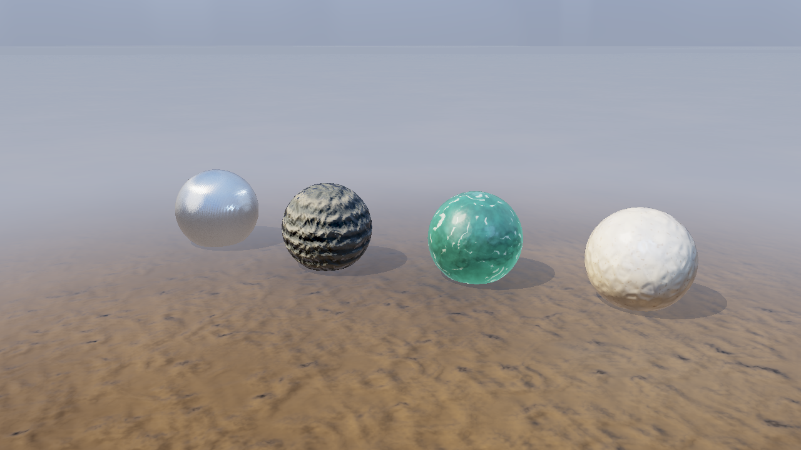
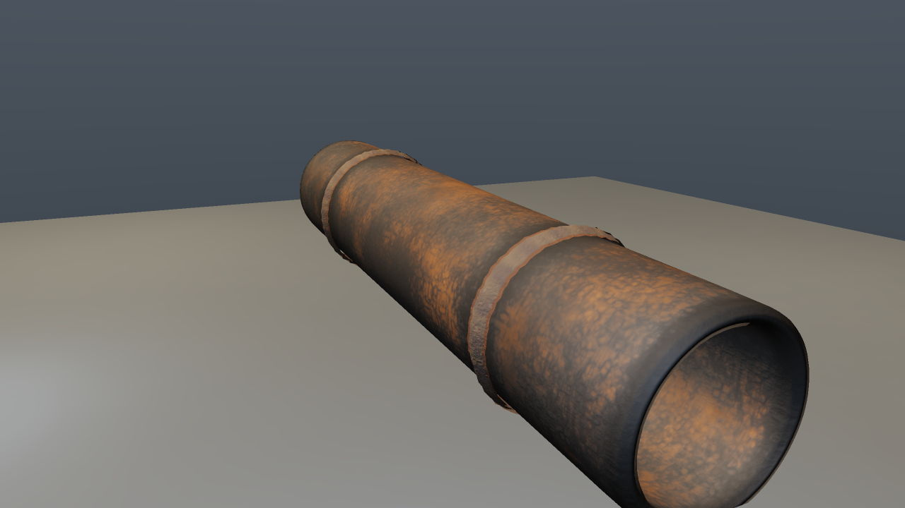
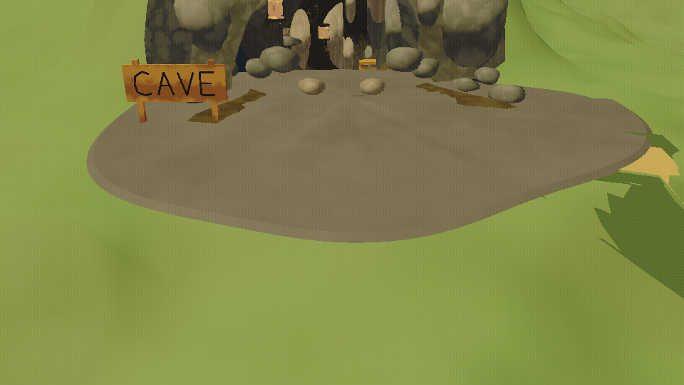
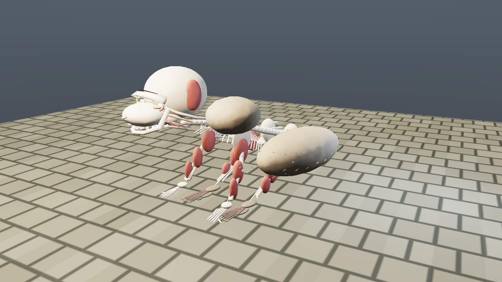
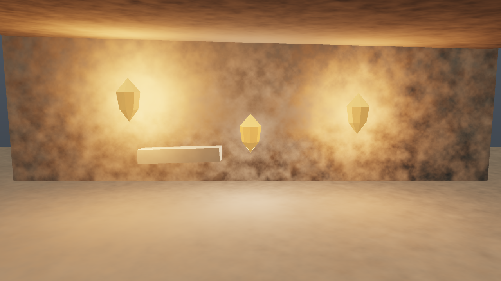

# Aster Learning Engine

Aster is an Agentic Asset Runtime built around a small inspectable engine
kernel. Agent-authored asset changes become runtime content only after they can
produce machine-readable proof: a visual brief, source graph, package output,
cooked asset database, preview artifact, and pass/fail report. It is not trying
to be a finished Unity/Unreal-style engine, a full commercial renderer platform,
or a sample game repository with engine code attached.

The stable public surface is deliberately narrow:

- `include/aster/kernel`: binary-stable C ABI with opaque handles, fixed-layout
  descriptors, validation events, world/frame diagnostics, and install-tree
  consumer checks.
- `include/aster/game_sdk`: source SDK for project, scene, prefab, material,
  item, action graph, and agent-authoring documents, including asset iteration
  review fields for presentation quality and surface-stack proof.
- `include/aster/aster.hpp`: first-contact C++ facade for opening Aster,
  loading a mesh/material, drawing a light, capturing a frame, and then opting
  into deeper inspection when needed.

Renderer, RHI, scene, systems, asset runtime, lab, and sample modules live in
the repository so the public contracts can be exercised end to end. They are not
all equally productized, and most are internal source contracts until
deliberately promoted. Lumen Run is sample content built on Aster; it is not the
engine boundary.

Start here: [docs/START_HERE.md](docs/START_HERE.md)

## 30-Second Path

- Build the repo, then run `./build/aster_quickstart --capture
  /tmp/aster_quickstart.ppm`.
- Use `include/aster/aster.hpp` when you want to draw before inspecting renderer
  details.
- Use the kernel ABI and Game SDK when you need a stable public contract.
- Use renderer/material docs, frame reports, and backend conformance tests when
  a visible result needs explanation.
- Use `aster_assetc asset-proof-run` when an agent-authored asset needs a
  proof bundle before it becomes runtime content.
- Treat samples and labs as evidence and examples, not as the product boundary.

## Maturity Map

| Area | Status | What to rely on |
| --- | --- | --- |
| Stable public contract | Product boundary | `include/aster/kernel` C ABI and `include/aster/game_sdk` source SDK |
| First-contact API | Convenience surface | `include/aster/aster.hpp` for quick draw/capture examples |
| Internal engine modules | Repository source contracts | Renderer, RHI, scene, systems, asset runtime, geometry, UI, and sample support |
| Validation/debug surfaces | Diagnostic product surfaces | `FrameForensics`, `WorldForensics`, GraphicsCore7 verdicts, frame reports, conformance artifacts |
| Research/internal experiments | Not productized APIs | Perception ledger, belief/perceptual ABIs, advanced world-continuity work |
| Showcases | Examples and regression content | Lumen Run, Aster Grid Tactics, Material Lab, Pipe Lab, Primate Lab, screenshot galleries |

## Pipe Lab Proof Run

Pipe Lab is Aster's first Agentic Asset Runtime proof cartridge. It turns the
rusted pipe visual brief, `.astergraph`, package output, cooked asset database,
and preview artifact into one proof bundle:

```bash
cargo run -p aster_assetc --bin aster_assetc -- asset-proof-run \
  --project showcases/pipe_lab/pipe_lab.asterproj \
  --asset asset_graph.pipe_lab.rusted_pipe \
  --reference assets/screenshots/industrial_pipe.png \
  --preview-artifact assets/screenshots/industrial_pipe.png \
  --output /tmp/aster_pipe_lab_proof \
  --output-schema
```

Read [docs/AGENTIC_ASSET_RUNTIME.md](docs/AGENTIC_ASSET_RUNTIME.md) for the
proof contract.

## 30-Second Regression Lab

The checked-in captures are generated from the current build and are organized
around visible renderer obligations, not sample-game marketing. They are
regression lab evidence, not a claim that every sample asset is production art.
A capture should show why a rock feels heavy, why wetness catches light, why a
cave has air, and why shadows and reflection probes are stable on the backend
that can prove them. The proof data is still required, but it serves the image:
image diff status, backend proof deltas, pass timings, asset hashes, shader
variant keys, material fidelity issues, and the frame-forensics timeline explain
what the viewer is seeing.











Engine contract batch visuals live in
[tests/artifacts/engine_contract_batch1](tests/artifacts/engine_contract_batch1/README.md).

## First Draw

Aster has a small source-level facade for first contact. Use it when you want to
draw, not inspect. The render graph, frame forensics, resource transitions, and
material compiler are still there, but they stay below this API until you ask
for them. Renderer truth is exposed through frame forensics and GraphicsCore7
rather than by making First Draw carry render-target formats, shadow-atlas
policy, timestamp queries, reflection-probe residency, or backend proof knobs.

```cpp
#include "aster/aster.hpp"

int main() {
  using namespace aster;

  InitAster(1280, 720, "Aster");
  Camera3D cam = MakeOrbitCamera({0.0f, 0.58f, 0.0f}, 5.0f, 64.0f, 15.0f);
  Material rust = LoadMaterial("showcases/material_lab/weathered_metal.astermat");
  Mesh pipe = LoadMesh("showcases/pipe_lab/rusted_pipe.astergraph");

  while (Frame()) {
    BeginScene(cam);
    DrawMesh(pipe, rust);
    DrawLight({-3.6f, 3.2f, 2.4f}, {8.0f, 6.4f, 4.8f}, 1.0f, 0.8f);
    EndScene();
  }

  CloseAster();
}
```

One-command capture after building:

```bash
./build/aster_quickstart --capture /tmp/aster_quickstart.ppm
```

Run built-in lab scenes when you want the inspected renderer path:

```bash
./build/aster_preview --scene material-lab --output assets/screenshots/material_lab.png --width 1280 --height 720 --samples 2
./build/aster_preview --scene mesh-lab --output /tmp/mesh_lab.ppm --width 1280 --height 720 --samples 2
./build/aster_preview --scene lighting-lab --output /tmp/lighting_lab.ppm --width 1280 --height 720 --samples 2
./build/aster_preview --scene scene-lab --output /tmp/scene_lab.ppm --width 1280 --height 720 --samples 2
./build/aster_preview --scene cercopithecidae --output /tmp/cercopithecidae_model.ppm --width 1280 --height 720 --samples 2
./build/aster_preview --scene clean-cave --output /tmp/clean_cave_showcase.ppm --width 1280 --height 720 --samples 2
./build/aster_preview --scene cave-conformance --output /tmp/cave_conformance.ppm --width 1280 --height 720 --samples 2
```

## What Is Included

- A C-compatible ABI 7.0 engine kernel with `AsterWorld`, opaque handles, C++
  RAII wrappers, strict validation events, rigid-body/frame-control telemetry,
  explicit texture/material/render target lifecycle, world/frame forensics,
  frame schedule reports, and an install-tree `external_app_minimal/` proof.
- A draw-first C++ facade in `include/aster/aster.hpp` for `InitAster`,
  `Frame`, `BeginScene`, `DrawMesh`, `DrawLight`, and `EndScene` quickstarts.
- A source-level game SDK for schema-versioned project, scene, prefab, material,
  item, action graph, and agent authoring documents.
- Aster-native classic simulation systems for deterministic commands/replay,
  lump archive lookup, actor combat states, world mechanisms, automap/HUD/wipe
  presentation, and lockstep command packets.
- A shared renderer core with `RenderDevice`, `RenderScene`, `FixedRenderGraph`,
  frame stats, frame forensics, capture, backend capability tables, and the
  GraphicsCore7 renderer truth spine for strict player-readable frame verdicts.
- A deterministic software reference renderer used for fallback presentation,
  Linux presentation, capture, preview rendering, and exact golden baselines.
- A macOS Metal renderer with native scene rendering, readback/capture,
  translucent sorting, procedural material shading, contact shadows, fog,
  cave-conformance shadow/fog/probe resources, tonemapping, frame pacing, and
  UI composition.
- A Windows D3D12 offscreen raster/readback backend for scene-contract and
  capability conformance. Full Windows GPU presentation is not implemented yet.
- Procedural geometry and mesh tooling for terrain, caves, tubes, cables,
  fracture pieces, water, architecture, vegetation, projected meshes, and
  generated scenery.
- Aster asset-contract tooling, including the
  `pipe_lab` rusted-pipe runtime asset with modifier-stack descriptors,
  bevel/weld/seam authoring, rust and wetness masks, UV island policy, LODs,
  collision proxy metadata, and cook reports. Its current captures are quality
  gates for iteration, not a guarantee that the asset is final production art.
  The older `primate_lab`
  biological-integument work remains a research lab, not a production character
  asset claim.
- Material/shader contracts for strict `.astermat` cooking, required
  albedo/normal/ORM LitPBR roles, source texture validation, typed material
  graph nodes, shader variants, render quality profiles, hot reload, and
  surface-fidelity audits for BSDF discipline, IBL/area-light response, shadow
  filtering, texture mip policy, tangent-space policy, temporal stability, and
  artist preview coverage.
- Separate compiler entrypoints: `aster_materialc` for material packages,
  `aster_texturec` for texture packages, and `aster_assetc` for project/scene
  bundle orchestration.
- A Rust runtime planner for frustum culling, draw-key grouping, translucent
  ordering, diagnostics, and offline asset-tool validation.
- A semantic math path where cameras and render helpers use typed
  `WorldPoint`, `ClipPoint`, `NdcPoint`, `ScreenPoint`, `WorldRay`, and
  `Viewport` contracts instead of ambiguous raw vectors.
- Typed color/material math with runtime `LinearRgb` and `EmissionColor`,
  explicit sRGB conversion helpers, and material importers that cross that
  boundary deliberately.
- Thin executable entrypoints for Lumen Run, Aster Grid Tactics, Studio,
  offline preview rendering, Material Lab, and the networking probe.

The current renderer/backend status is intentionally conservative. Use
[docs/RENDERER_BACKEND_MATRIX.md](docs/RENDERER_BACKEND_MATRIX.md) as the truth
source for advertised backend support, gaps, presentation paths, and conformance
requirements.

## Docs Map

| Path | Purpose |
| --- | --- |
| [docs/START_HERE.md](docs/START_HERE.md) | First reading path |
| [docs/AGENTIC_ASSET_RUNTIME.md](docs/AGENTIC_ASSET_RUNTIME.md) | Agent-authored asset proof runs and Pipe Lab proof cartridge |
| [docs/SIMPLE_API.md](docs/SIMPLE_API.md) | Draw-first API before renderer inspection |
| [docs/WHAT_ASTER_IS.md](docs/WHAT_ASTER_IS.md) | Engine identity and non-goals |
| [docs/PRODUCT_PATH.md](docs/PRODUCT_PATH.md) | Staged product roadmap, maturity boundaries, and gaps |
| [docs/RENDERING_PIPELINE.md](docs/RENDERING_PIPELINE.md) | Scene-to-render-graph-to-backend flow |
| [docs/MATERIALS_AND_SHADERS.md](docs/MATERIALS_AND_SHADERS.md) | Material authoring, shader library, typed graph |
| [docs/SCENE_AND_MESH_PIPELINE.md](docs/SCENE_AND_MESH_PIPELINE.md) | Scene objects and procedural/custom mesh path |
| [docs/AGENT_AUTHORING.md](docs/AGENT_AUTHORING.md) | Agent-safe project plans, batches, and handoffs |
| [docs/RENDERER_BACKEND_MATRIX.md](docs/RENDERER_BACKEND_MATRIX.md) | Backend capabilities, pass support, gaps, conformance |
| [docs/LUMEN_RUN_AS_SAMPLE.md](docs/LUMEN_RUN_AS_SAMPLE.md) | How the sample game uses the engine |
| [docs/ENGINE_INTERNALS/ENGINE_KERNEL.md](docs/ENGINE_INTERNALS/ENGINE_KERNEL.md) | ABI and public/internal boundary |
| [docs/ENGINE_INTERNALS/ARCHITECTURE.md](docs/ENGINE_INTERNALS/ARCHITECTURE.md) | Deeper architecture notes |
| [docs/RESEARCH/RESEARCH_NOTES.md](docs/RESEARCH/RESEARCH_NOTES.md) | Research notes |

Showcase manifests live under `showcases/`.

## Build

Prerequisites:

- CMake 3.24+
- A C++20 compiler
- Rust 1.88+ with Cargo
- macOS with Cocoa and Metal, Linux with Wayland development packages and/or X11,
  or Windows with the Win32 desktop SDK

Configure, build, and test:

```bash
cmake -S . -B build -DCMAKE_BUILD_TYPE=Release
cmake --build build --parallel
ctest --test-dir build --output-on-failure
cargo test --workspace
```

Run the sample game and tools:

```bash
./build/aster_quickstart --capture /tmp/aster_quickstart.ppm
./build/aster_lumen_run
./build/aster_lumen_run --capture-route classic-gauntlet
./build/aster_grid_tactics --no-vsync
./build/aster_grid_tactics --replay-self-test --seed 4242 --ticks 260
./build/aster_studio
./build/aster_material_lab --material showcases/material_lab/wet_rock.astermat --output /tmp/wet_rock.ppm
cargo run -p aster_assetc --bin aster_materialc -- package --input showcases/material_lab/wet_rock.astermat --asset-root showcases/material_lab --output /tmp/aster_material_package
cargo run -p aster_assetc --bin aster_texturec -- package --input showcases/material_lab/wet_rock_albedo.ktx2 --role albedo --output /tmp/aster_texture_package
cargo run -p aster_assetc --bin aster_assetc -- material-inspect --input showcases/material_lab/wet_rock.astermat --asset-root showcases/material_lab
cargo run -p aster_assetc --bin aster_assetc -- graph-inspect --input showcases/material_lab/procedural_wet_rock.astergraph
cargo run -p aster_assetc --bin aster_assetc -- graph-package --input showcases/material_lab/procedural_wet_rock.astergraph --output /tmp/aster_asset_graph_package
cargo run -p aster_assetc --bin aster_assetc -- cook --project showcases/material_lab/material_lab.asterproj --platform desktop --output showcases/material_lab/cooked/desktop
cargo run -p aster_assetc --bin aster_assetc -- report --db showcases/material_lab/cooked/desktop/assetdb.asterdb.json
./build/aster_material_lab --graph showcases/material_lab/cooked/desktop/asset_graphs/asset_graph.material_lab.wet_rock.assetgraphbin --output /tmp/wet_rock_graph.ppm
cargo run -p aster_assetc --bin aster_assetc -- graph-package --input showcases/pipe_lab/rusted_pipe.astergraph --output /tmp/aster_pipe_graph_package
cargo run -p aster_assetc --bin aster_assetc -- cook --project showcases/pipe_lab/pipe_lab.asterproj --platform desktop --output /tmp/aster_pipe_lab_cooked
cargo run -p aster_assetc --bin aster_assetc -- asset-proof-run --project showcases/pipe_lab/pipe_lab.asterproj --asset asset_graph.pipe_lab.rusted_pipe --reference assets/screenshots/industrial_pipe.png --preview-artifact assets/screenshots/industrial_pipe.png --output /tmp/aster_pipe_lab_proof --output-schema
```

`.astergraph` is the V1 procedural asset graph format and cooks to
`assetgraphbin` packages with stable graph/node identity, procedural material IR,
quality diagnostics, shader/pipeline keys, and FrameForensics provenance.
Material cooking is strict by default. Legacy/import `.astermat` `LitPBR`
materials must resolve to `albedo`, `normal`, and `orm`; `albedo` and
`emissive` are sRGB, while normal, ORM, height, wetness, opacity, and masks are
linear/non-color. KTX2 sources can pass through directly. Other source image
formats require `ASTER_TEXTURE_ENCODER` to point at a real encoder command, and
missing or invalid required textures make `aster_assetc cook` return nonzero
after writing diagnostics.

Set `ASTER_FORCE_SOFTWARE_RENDERER=1` on macOS to use the deterministic
software fallback.

## Backend Status

| Platform | Backend | Status |
| --- | --- | --- |
| macOS | Metal | Native scene renderer and presentation |
| Windows | D3D12 | Native offscreen raster/readback conformance path; no full GPU presentation yet |
| Windows | Software | Production Windows presentation path through Win32/GDI today |
| Linux | Software | Wayland/X11 presentation with deterministic software rendering |
| Any | Software | Reference fallback, preview, capture, and golden baseline |

Runtime capability details are available through
`aster_kernel_renderer_get_backend_capability_table`. The old capability flags
remain compatibility summaries for current ABI/editor consumers.

## Checks

The highest-signal renderer checks are:

```bash
ctest --test-dir build -R aster_render_backend_conformance_tests --output-on-failure
ctest --test-dir build -R aster_material_shader_system_tests --output-on-failure
```

The conformance suite stores deterministic software baselines in
`tests/golden/render/`, including the engine-owned `cave_conformance` proof
frame. Native support for shadow, fog, and probe resources requires matching
resource-capability bits, non-empty debug captures, and final-frame sampling;
declared graph passes alone are reported as `CapabilityMismatch`.

Run smoke and frame-report checks after platform, renderer, UI, or sample-loop
changes:

```bash
./build/aster_lumen_run --smoke-test --no-vsync
./build/aster_grid_tactics --smoke-test --no-vsync
./build/aster_studio --smoke-test
./build/aster_lumen_run --frame-report --run-frames 240 --lag-budget-ms 16.7 --window-width 1280 --window-height 720 --msaa 0
./build/aster_lumen_run --frame-report --frame-report-route classic-gauntlet --run-frames 240 --window-width 1280 --window-height 720 --msaa 0
./build/aster_grid_tactics --frame-report --run-frames 120 --no-vsync
```

## Refresh Regression Captures

Generate fresh captures after renderer, material, or sample-scene changes, then
compare them against the software golden baselines before treating them as
gallery material.

```bash
mkdir -p assets/screenshots /tmp/aster_learning_shots

./build/aster_preview --scene material-lab --output assets/screenshots/material_lab.png --width 1280 --height 720 --samples 2
./build/aster_preview --scene mesh-lab --output /tmp/aster_learning_shots/mesh_lab.ppm --width 1280 --height 720 --samples 2
./build/aster_preview --scene lighting-lab --output /tmp/aster_learning_shots/lighting_lab.ppm --width 1280 --height 720 --samples 2
./build/aster_preview --scene scene-lab --output /tmp/aster_learning_shots/scene_lab.ppm --width 1280 --height 720 --samples 2
./build/aster_preview --scene cave-conformance --output /tmp/aster_learning_shots/cave_conformance.ppm --width 1280 --height 720 --samples 2
./build/aster_preview --scene industrial-pipe --output /tmp/aster_learning_shots/industrial_pipe.ppm --width 1280 --height 720 --samples 2
./build/aster_lumen_run --screenshot /tmp/aster_learning_shots/lumen_run.ppm --capture-route classic-gauntlet --screenshot-frame 160 --capture-hud --msaa 0 --window-width 1280 --window-height 720
./build/aster_lumen_run --screenshot /tmp/aster_learning_shots/lumen_cave_interior.ppm --capture-route classic-gauntlet --screenshot-frame 160 --msaa 0 --window-width 1280 --window-height 720
./build/aster_grid_tactics --screenshot /tmp/aster_learning_shots/aster_grid_tactics.ppm --screenshot-frame 16 --no-vsync

sips -s format png /tmp/aster_learning_shots/mesh_lab.ppm --out assets/screenshots/mesh_lab.png
sips -s format png /tmp/aster_learning_shots/lighting_lab.ppm --out assets/screenshots/lighting_lab.png
sips -s format png /tmp/aster_learning_shots/scene_lab.ppm --out assets/screenshots/scene_lab.png
sips -s format png /tmp/aster_learning_shots/cave_conformance.ppm --out assets/screenshots/cave_conformance.png
sips -s format png /tmp/aster_learning_shots/industrial_pipe.ppm --out assets/screenshots/industrial_pipe.png
sips -s format png /tmp/aster_learning_shots/lumen_run.ppm --out assets/screenshots/lumen_run.png
sips -s format png /tmp/aster_learning_shots/lumen_cave_interior.ppm --out assets/screenshots/lumen_cave_interior.png
sips -s format png /tmp/aster_learning_shots/aster_grid_tactics.ppm --out assets/screenshots/aster_grid_tactics.png
```

On non-macOS hosts, use an equivalent PPM-to-PNG encoder.

## Clean Worktree Policy

Generated local state is disposable. Before broad cleanup, inspect first:

```bash
git status --short --ignored
git clean -ndX
git clean -nd
```

Remove ignored build/cache artifacts only when they are no longer needed:

```bash
git clean -fdX
```

## License

The engine core is Apache-2.0. Commercial games and applications may use the
core without a runtime royalty.

Aster-owned sample content, screenshots, showcase assets, project files, and
branding are covered separately by
[LICENSES/ASTER-CONTENT-LICENSE.md](LICENSES/ASTER-CONTENT-LICENSE.md).
Commercial reuse of Aster-branded content or marks requires written permission.
See [COMMERCIAL.md](COMMERCIAL.md) and [TRADEMARKS.md](TRADEMARKS.md).
