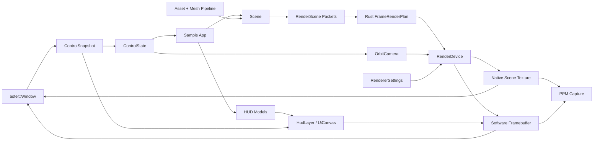

# Aster Architecture

Aster keeps product code thin and reusable behavior in engine modules. The core
rule is that app files wire systems together; they do not own platform handles,
protocol parsing, geometry processing, renderer policy, or research logic.

## Engine Kernel Boundary

The stable public surface is `include/aster/kernel`, backed by the
`aster_kernel` target. Its ABI is plain C: versioned structs, fixed-width status
codes, spans/string views, and opaque handles. The public C++ layer is a
header-only convenience wrapper compiled by the consumer; it is not exported as
binary C++ class ABI.

All other headers under `include/aster` are internal engine source contracts for
repository targets. They are intentionally not installed by `aster_kernel`.
Changing them is a source-level engine refactor, not an ABI break. Promoting a
subsystem to the public kernel requires a versioned handle contract, explicit
ownership rules, status-returning failure behavior, and tests that include only
`aster/kernel`.

## Source Game SDK Boundary

The public game-authoring surface starts at `include/aster/game_sdk`, backed by
the `aster_game_sdk` target. This is intentionally separate from the binary
kernel ABI: it is a source-level C++ SDK for project, scene, prefab, material,
item, component, and action graph documents. SDK headers may use STL containers
because consumers compile them with their own toolchain; they must not include
internal `include/aster/{scene,systems,samples,render}` headers.

Authoring documents are schema-versioned JSON. The SDK loader validates
`.asterproj`, game `.scene`, `.prefab`, `.material`, `.item`, and
`.action_graph` documents into explicit data models, then instantiates them into
an SDK `World`. The action graph runtime emits typed action events from data
nodes instead of routing gameplay through string-prefix target IDs. Engine
runtime adapters can consume these SDK models later, but product apps should not
copy project loading or schema validation into their own code.

`projects/lumen_run` is the first SDK project seed. `aster_lumen_run` validates
that project during boot, while the current hand-authored C++ simulation remains
transitional until its items, interactions, prefabs, and scene placements are
fully driven by SDK documents.

## Module Boundaries

`include/aster/kernel`

Stable public ABI and C++ wrappers. Kernel headers must not include broad engine
headers, STL containers in ABI structs, native platform types, renderer backend
types, or sample-owned state. Public resources cross this boundary only as
opaque handles with matching destroy functions.

`include/aster/game_sdk`

Public source SDK for game authoring. This layer owns schema-versioned project
manifests, entity/component scene documents, prefab documents, item/material
documents, and data-driven action graphs. It must stay reusable and independent
from sample code, renderer internals, and kernel ABI handles.

`include/aster/math`

Vector, matrix, transform, color, and procedural noise utilities. This layer is
standard C++ only and does not depend on platform, renderer, game, or UI code.
These headers are internal source contracts unless re-exposed through the kernel
ABI.

`include/aster/asset`

CPU-side scene import and mesh preparation. Importers translate data into engine
materials and mesh primitives. The mesh pipeline validates topology, rebuilds
missing normals, generates tangents, compacts equivalent vertices, and performs
bounded cache/fetch ordering before render code sees the mesh.

`include/aster/geometry`

Reusable geometry generation and queries: brush level mesh construction,
terrain, cave tunnel/formation placement, authored cave complexes, castle, nature,
generated scenery assembly, and procedural support-surface helpers. Public
gameplay-facing APIs remain stable where practical, including
`buildBrushLevelMesh(...)`, `buildCaveComplex(...)`, `VoxelCaveState`, and
`assembleGeneratedScenery(...)`. Cave entrance fitting, sealed portal/throat
geometry, reusable grass and ground-detail scatter, authored deep-cave sections,
fixture placement, collision meshes, ore nodes, and formation placement belong
in this layer so games wire specs instead of rebuilding generation rules.

`include/aster/net`

Message framing, routing, and TCP transport. `NetMessage`, `NodeRouter`, and
`TcpNode` stay as the app-facing contracts. The transport is a POSIX socket
event loop with owned queues and frame decoding; application code never parses
socket bytes directly.

`include/aster/core`

Configuration, clocks, frame timing, and profiling. The profiler macros map to a
lightweight CPU trace sink with scope timing, an in-memory ring, and text export.

`include/aster/platform`

`aster::Window` owns the native platform boundary. macOS, Linux, and Windows
have separate source files; all native handles stay inside those files. Engine
and app code receive viewport sizes and `ControlSnapshot` values.

`include/aster/render`

Camera contracts, render-scene packets, mesh data, renderer settings, software
framebuffer capture, and `RenderDevice`. macOS uses an owned Metal backend for
real-time scene rendering. The software renderer remains the deterministic
fallback, capture path, preview path, and reference implementation.
`SurfacePattern` is the shared procedural material contract across native and
software rendering.

`RenderDevice` is the renderer orchestrator. Backend implementations own API-
specific resource creation, encode work, and presentation details. The fixed
render graph contract is shared across backends and currently spans
`scene-color-depth`, `opaque`, `contact-shadow`, `transparent`, `ui-composite`,
and `capture` passes, with explicit lifetime tags for frame-local and readback
resources.

`crates/aster_runtime`

Required Rust runtime code behind a stable C ABI. The runtime owns frame render
planning over renderer-facing packets: frustum culling, draw-key grouping,
instance ordering, translucent back-to-front ordering, and render diagnostics.
C++ owns scene extraction, platform resources, software rasterization, and Metal
command submission; Rust owns reusable data planning that should not live in
game or app code.

`crates/aster_content`

Rust content pipeline code for imported/static scene assets. This layer imports
the supported `.scene` JSON plus external buffers, prepares mesh data, extracts
material and texture dependency metadata, builds static collision payloads, and
writes deterministic `.astercache` runtime files. It is a reusable library; CLI
argument parsing and app behavior stay outside it.

`crates/aster_assetc`

Rust asset compiler CLI. It delegates content import/cache writing to
`aster_content`, keeps `--self-check` for the shared Rust render planner, and
provides `compile`/`inspect` commands instead of duplicating compiler logic in
product executables.

`include/aster/scene`

Renderable scene data. Scene objects carry transforms, materials, object flags,
and optional generated meshes. Materials expose explicit alpha, depth, render
queue, procedural surface, and camera-occlusion policy through `MaterialDesc`
and related helpers. Scene data does not own platform resources.

`include/aster/systems`

Reusable simulation and gameplay-facing systems: movement, interaction,
inventory, items, equipment, lighting, particles, creature motion, and camera
behavior. These modules are sample-agnostic and must not encode Lumen Run
content assumptions.

`include/aster/samples`

Sample-owned contracts and authored scene builders for repository builds. Lumen
Run and showcase scenes consume engine, geometry, renderer, UI, physics, systems
modules, and the public game SDK from the outside. Sample code can be
content-specific; engine, SDK, and systems code cannot. Lumen Run is not part of
the stable engine kernel; if a sample needs external binary access, it must be
exposed through an opaque `AsterSampleAppHandle` facade rather than a public
header containing sample state. Source-only helpers live beside
`src/samples/lumen_run_*.cpp` so Lumen-specific placement, material, and route
data do not become engine defaults by accident.

`include/aster/ui`

Immediate UI canvas, HUD, inventory overlay, editor UI, and control legends. UI
consumes explicit data models and input snapshots. Canvas clipping and panel
scrolling are part of the UI contract, so editor controls can grow without
requiring app-specific layout branches.

`apps`

Executable wiring only. `aster_lumen_run`, `aster_studio`, `aster_preview`, and
`aster_net_probe` compose engine systems but do not own engine internals.

## Render Flow

## Platform Boundary

Native platform code is isolated by operating system:

- `src/platform/window_macos.mm` owns the Cocoa window, event pump, cursor modes,
  Metal layer presentation, and software framebuffer fallback presentation.
- `src/platform/window_linux.cpp` owns both Linux desktop paths. Wayland is
  preferred when available and uses `libwayland-client` behind the platform
  adapter for registry discovery, stable xdg-shell toplevels, wl_shm software
  buffers, buffer-release ownership, seat keyboard/pointer input, ARGB cursor
  surfaces, and optional relative pointer plus persistent pointer lock. The raw
  X11 socket protocol path remains the fallback, including setup, window
  creation, input events, close protocol, cursor hiding, pointer recentering,
  and framebuffer presentation.
- `src/platform/window_windows.cpp` owns the Win32 window, message pump, DPI
  awareness, keyboard and mouse state, raw mouse deltas for disabled-cursor
  mode, cursor clipping/visibility, GDI/DIB software presentation, and
  waitable-timer frame pacing.

No public header exposes native window handles. New platform work should extend
the adapter behind `aster::Window` rather than adding product-level branches.

## Renderer Policy

`RenderDevice` owns renderer selection and mesh preparation. On macOS, the
default backend is `Aster Native Metal Rasterizer`; it uploads prepared meshes
to Metal buffers, consumes a Rust-built frame plan, renders opaque planned
groups with instanced draws, renders contact shadows, renders translucent
groups in sorted order, streams object uniforms through a frame-local buffer,
evaluates procedural material shading, and composites the UI overlay from the
software framebuffer. `ASTER_FORCE_SOFTWARE_RENDERER=1` selects the
deterministic software renderer.

The software renderer handles tiled rasterization, depth, alpha, procedural
material evaluation, contact shadows, fog, grading, tonemapping, and capture.
Native capture waits for the Metal scene command buffer, reads the scene texture,
and composites the software UI overlay using the same top-left framebuffer
origin as live presentation.

Windows now has a D3D12 bootstrap backend that validates device and command queue
creation, reports backend capabilities, and preserves the software framebuffer
capture path. It is a second GPU backend entry point, not a finished scene
renderer. Full scene drawing still lives in the Metal and software paths.

Procedural material evaluation is pattern-driven rather than sample-specific.
Terrain, water, cave rock, coal veins, foliage, fur, amber, wood, stone, scales,
feathers, weathered metal, weld beads, and fiber patterns are selected through
`Material::surface_pattern` and parameterized by material fields. New patterns
should extend that contract in both renderers rather than adding sample-side
shader branches.

Material compilation is split from runtime scene packets. Authoring imports flow
through a shared compiler step that produces permutation flags, a stable cache
key, and a pipeline tag before runtime binding.

Renderer policy belongs in `src/render` and `crates/aster_runtime`. Scene
description belongs in `src/scene` and `src/samples`. App files should only
select settings and pass them to the renderer.

The offline preview path uses `aster::renderSoftwarePreview`, so ray traversal,
material preview shading, and PPM-backed framebuffer output remain in the render
layer. `apps/offline/preview_main.cpp` is limited to argument parsing, scene
selection, camera setup, and output location.

`RenderDevice::prepareScene` updates the C++ render-scene cache and mesh
preparation cache. Every frame, `RenderDevice::render` extracts current
renderer-facing packets, calls the Rust planner, and sends the resulting
`FrameRenderPlan` to the native or software backend. Native Metal batches
compatible planned instances into instanced draw calls when their effective
cull policy matches; the software renderer consumes the same plan for
deterministic ordering and diagnostics. Custom mesh local bounds are cached in
`RenderScene` so large generated meshes do not need their bounds recomputed on
every frame.

## Frame Pacing

Interactive executables default to synchronized, 60 Hz frame pacing. `--unlocked`
is the explicit opt-in for unbounded loops. Screenshot and sequence capture paths
use deterministic fixed timing so generated media stays reproducible.

## Build Policy

CMake builds `aster_engine_internal` for repository apps/tests and
`aster_kernel` as the exported ABI facade. Platform source selection is based on
the host OS. Linux builds require `wayland-client`, `wayland-protocols`, and
`wayland-scanner`; CMake generates the xdg-shell, relative-pointer, and
pointer-constraints protocol bindings into the build tree. Cargo is a required
build dependency and builds the Rust `aster_runtime` static library before
linking the internal engine target. Windows builds link the Win32 platform
libraries required by the adapter.

The engine and sample should build without fetching source code at configure or
build time. Linux's `libwayland-client` dependency is an explicit platform
adapter dependency; app, renderer, UI, sample, and kernel headers must not
include Wayland or X11 types. Direct OS interaction belongs only in platform
adapters.

## Test Policy

CTest exposes subsystem targets instead of a single catch-all executable:
`aster_kernel_public_consumer`, `aster_kernel_contract_tests`,
`aster_game_sdk_public_consumer`, `aster_core_tests`, `aster_geometry_tests`,
`aster_render_scene_tests`, `aster_systems_tests`, `aster_physics_tests`,
`aster_sample_tests`, and `aster_network_tests` when networking is enabled.
Shared test helpers are local to `tests/` and must not become engine API. New
coverage should land in the target that owns the contract being changed;
sample-specific regression checks belong in the sample target unless they first
extract a reusable engine or SDK contract.

## Known Compromises

- Linux now prefers Wayland and falls back to raw X11, but both Linux paths
  present software frames. GPU shader rendering is only implemented for macOS
  Metal today.
- Wayland disabled-cursor mode uses relative-pointer and pointer-constraints
  when the compositor advertises them. If a compositor omits those optional
  protocols, Aster keeps the cursor hidden and reports deltas derived from
  focused absolute pointer motion instead of silently inventing unsupported
  pointer warping.
- Windows has a native Win32 window/input/software presentation path. Native
  Windows GPU rendering is represented by a bootstrap D3D12 backend that
  validates device creation and capability reporting. It does not yet replace
  the Metal/software draw path for full scene rendering; app code should still
  treat Metal and software as the production renderers today.
- The scene importer supports the subset of JSON scene data exercised by
  generated tests and engine-authored scenes. Expanding file-format coverage
  should extend that importer without
  changing renderer contracts.
- The UI system is intentionally immediate and compact. It covers the controls
  required by the game and studio, not a retained-mode application framework.
