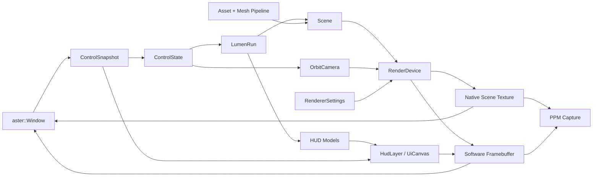

# Aster Architecture

Aster keeps product code thin and reusable behavior in engine modules. The core
rule is that app files wire systems together; they do not own platform handles,
protocol parsing, geometry processing, renderer policy, or research logic.

## Module Boundaries

`include/aster/math`

Vector, matrix, transform, color, and procedural noise utilities. This layer is
standard C++ only and does not depend on platform, renderer, game, or UI code.

`include/aster/asset`

CPU-side scene import and mesh preparation. Importers translate data into engine
materials and mesh primitives. The mesh pipeline validates topology, rebuilds
missing normals, generates tangents, compacts equivalent vertices, and performs
bounded cache/fetch ordering before render code sees the mesh.

`include/aster/geometry`

Reusable geometry generation and queries: brush level mesh construction,
terrain, cave tunnel/formation placement, voxel cave streaming, castle, nature,
generated scenery assembly, and procedural support-surface helpers. Public
gameplay-facing APIs remain stable where practical, including
`buildBrushLevelMesh(...)`, `buildCaveComplex(...)`, `VoxelCaveState`, and
`assembleGeneratedScenery(...)`. Cave entrance fitting, sealed portal/throat
geometry, streaming cave chunks, fixture placement, collision meshes, ore nodes,
and formation placement belong in this layer so games wire cave specs instead of
rebuilding cave rules.

`include/aster/net`

Message framing, routing, and TCP transport. `NetMessage`, `NodeRouter`, and
`TcpNode` stay as the app-facing contracts. The transport is a POSIX socket
event loop with owned queues and frame decoding; application code never parses
socket bytes directly.

`include/aster/core`

Configuration, clocks, frame timing, and profiling. The profiler macros map to a
lightweight CPU trace sink with scope timing, an in-memory ring, and text export.

`include/aster/platform`

`aster::Window` owns the native platform boundary. macOS and Linux have separate
source files; all native handles stay inside those files. Engine and app code
receive viewport sizes and `ControlSnapshot` values.

`include/aster/render`

Camera contracts, mesh data, renderer settings, software framebuffer capture,
and `RenderDevice`. macOS uses an owned Metal backend for real-time scene
rendering. The software renderer remains the deterministic fallback, capture
path, preview path, and reference implementation. `SurfacePattern` is the shared
procedural material contract across native and software rendering.

`include/aster/scene`

Renderable scene data. Scene objects carry transforms, materials, object flags,
and optional generated meshes. Materials expose explicit alpha, depth, render
queue, procedural surface, and camera-occlusion policy through `MaterialDesc`
and related helpers. Scene data does not own platform resources.

`include/aster/game`

Reusable gameplay systems for Lumen Run: movement, interaction, inventory,
items, lighting, particles, creature motion, camera behavior, and game state.

`include/aster/ui`

Immediate UI canvas, HUD, inventory overlay, editor UI, and control legends. UI
consumes explicit data models and input snapshots. Canvas clipping and panel
scrolling are part of the UI contract, so editor controls can grow without
requiring app-specific layout branches.

`apps`

Executable wiring only. `aster_lumen_run`, `aster_studio`, `aster_preview`, and
`aster_net_probe` compose engine systems but do not own engine internals.

## Render Flow

## Platform Boundary

Native platform code is isolated by operating system:

- `src/platform/window_macos.mm` owns the Cocoa window, event pump, cursor modes,
  Metal layer presentation, and software framebuffer fallback presentation.
- `src/platform/window_linux.cpp` owns the raw X11 socket protocol path,
  including setup, window creation, input events, close protocol, cursor hiding,
  pointer recentering, and framebuffer presentation.

No public header exposes native window handles. New platform work should extend
the adapter behind `aster::Window` rather than adding product-level branches.

## Renderer Policy

`RenderDevice` owns renderer selection and mesh preparation. On macOS, the
default backend is `Aster Native Metal Rasterizer`; it uploads prepared meshes
to Metal buffers, builds a per-frame camera-visible workset, renders opaque
objects with depth, sorts translucent objects, streams object uniforms through a
frame-local buffer, evaluates procedural material shading, and composites the UI
overlay from the software framebuffer. `ASTER_FORCE_SOFTWARE_RENDERER=1` selects
the deterministic software renderer.

The software renderer handles tiled rasterization, depth, alpha, procedural
material evaluation, contact shadows, fog, grading, tonemapping, and capture.
Native capture waits for the Metal scene command buffer, reads the scene texture,
and composites the software UI overlay using the same top-left framebuffer
origin as live presentation.

Procedural material evaluation is pattern-driven rather than sample-specific.
Terrain, water, cave rock, coal veins, foliage, fur, amber, wood, stone, scales,
feathers, and fiber patterns are selected through `Material::surface_pattern`
and parameterized by material fields. New patterns should extend that contract
in both renderers rather than adding game-side shader branches.

Renderer policy belongs in `src/render`. Scene description belongs in
`src/scene` and `src/game`. App files should only select settings and pass them
to the renderer.

## Frame Pacing

Interactive executables default to synchronized, 60 Hz frame pacing. `--unlocked`
is the explicit opt-in for unbounded loops. Screenshot and sequence capture paths
use deterministic fixed timing so generated media stays reproducible.

## Build Policy

CMake builds one static `aster` library plus small executables. Platform source
selection is based on the host OS. Aster v1 does not carry Windows or Wayland
compatibility code.

The engine and sample should build without fetching source code or linking
desktop client libraries. Direct OS interaction belongs only in platform
adapters.

## Known Compromises

- Linux presentation targets raw X11 first. Wayland can be added through the same
  `aster::Window` contract without changing app, game, renderer, or UI code.
- Linux currently presents software frames; GPU shader rendering is only
  implemented for macOS Metal.
- The scene importer supports the subset of JSON scene data exercised by
  generated tests and engine-authored scenes. Expanding file-format coverage
  should extend that importer without
  changing renderer contracts.
- The UI system is intentionally immediate and compact. It covers the controls
  required by the game and studio, not a retained-mode application framework.
