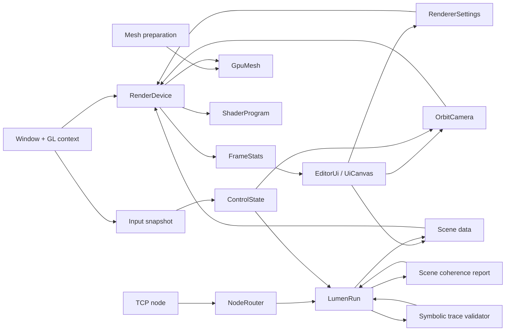

# Aster Architecture

Aster separates reusable engine code from application code from the first commit. The intent is to keep research logic, rendering logic, scene contracts, and UI controls out of each other's way.

## Module Boundaries

`include/aster/math`

Pure vector, matrix, and color utilities. This layer has no platform, renderer, or UI dependency.

`include/aster/input`

Command-oriented input contracts. The library stores named commands and bindings, then resolves per-frame command state from a platform snapshot. It does not know about window backends or editor behavior.

`include/aster/asset`

CPU-side asset preparation contracts. Scene documents are parsed into material slots and mesh primitives, then mesh data is validated, deterministically repaired where possible, assigned SurfaceBasis tangents, and reordered for GPU-friendly index and vertex access before render backends see it.

`include/aster/net`

Network contracts. The frame codec and node router are pure C++ and can be tested without sockets. The TCP node is an optional transport that feeds decoded messages into the same router instead of forcing app code to own protocol parsing.

`include/aster/game`

Reusable gameplay systems. `LumenRun` owns gameplay state and writes a renderable `Scene`, while the executable only wires windowing, controls, rendering, and HUD.

`include/aster/scene`

Data contracts for renderable objects. Scene objects own inspectable transform/material data, but they do not own GPU resources and do not call renderer APIs.

The scene module also owns the backend-neutral coherence contract used to compare
sampled visual, collision, navigation, visibility, material, light, and fluid
layers. It reports inspectable energy contributions instead of pushing
research or game-specific inference rules into app code.

The same module owns symbolic scene trace validation. Runtime or build-time
samplers can encode player-facing evidence as ordered symbol words, then validate
those words with bounded-horizon language rules such as forbidden events,
same-frame implications, and finite-window continuity. The implementation keeps
the rule DSL generic; games provide only the evidence-to-symbol adapter.

`include/aster/render`

Camera, mesh generation/upload, shader management, and render submission. The public `RenderDevice` contract is intentionally smaller than the current OpenGL implementation so future backends can implement the same responsibility without leaking API-specific handles into product code.

`include/aster/platform`

Window and graphics context ownership. The input bridge lives here because it translates platform state into the engine's platform-neutral input snapshot.

`include/aster/ui`

Editor and HUD surfaces. UI code reads and writes explicit engine data through the engine-owned `UiCanvas`; it does not compute render policy or own scene resources.

`apps`

Thin executables. `aster_studio` wires the editor together. `aster_lumen_run` wires the game together. `aster_preview` provides headless visual verification without requiring a GPU context.

## Current Render Flow

## Backend Strategy

The OpenGL renderer is the first backend, not the engine architecture. Future backends should implement the same high-level responsibilities:

- Resource creation and lifetime
- Shader/pipeline ownership
- Draw submission
- Frame statistics
- Capability reporting

The scene layer should remain backend-neutral. Backend-specific capabilities should be exposed through explicit feature reports, not through scattered `#ifdef` branches in app code.

## Known Compromises

- Windowing, OpenGL loading, profiling, and TCP transport support are built from engine-owned runtime sources, so a clean checkout can configure without fetching code.
- The macOS build uses Aster's native Cocoa windowing bridge internally. Most engine source is C/C++, while platform bridge files may compile through Objective-C where the OS requires it.
- The current renderer is OpenGL. This is a portability baseline, not the final high-performance Apple Silicon backend.
- The current UI layer is intentionally compact: it covers panels, bitmap text, buttons, checkboxes, sliders, progress bars, and HUD drawings used by the sample game and studio. It is not a general retained-mode editor framework.
- The preview renderer approximates non-uniformly scaled spheres with a representative radius. The interactive renderer handles full object matrices.
- Native screenshots use `glReadPixels`, so they validate the actual OpenGL framebuffer rather than a browser harness.
- The first network transport is a compact TCP loopback implementation. Higher-level replication, login, proxy, and world services should be built as named router services rather than fixed server categories.
